# Oxide-S3
Oxide-S3 is a retro spotift interface featuring a large TFT screen, a small OLED screen, 6 tactile switches, and 2 rotary encoders, all running on an ESP32-WROOM-1.

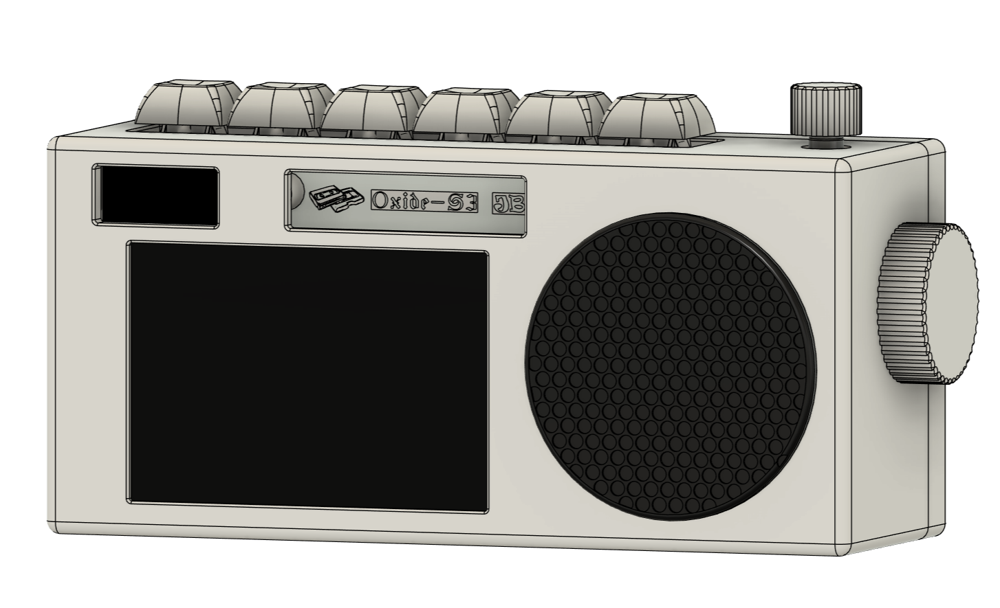

The device uses three seperate PCBs, one for the front, one for the top, and one for the side. The front PCB includes the displays, LiPo battery management, the MCU, and USB-C for charging. The top PCB includes the 6 Cherry MX Blue switches, and one of the rotary encoders. The side PCB simply includes the final rotary encoder. The small PCBs are connected to the front PCB using JST-XH cables.

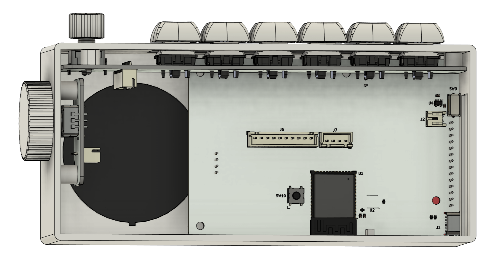

# The PCBs

Front PCB:

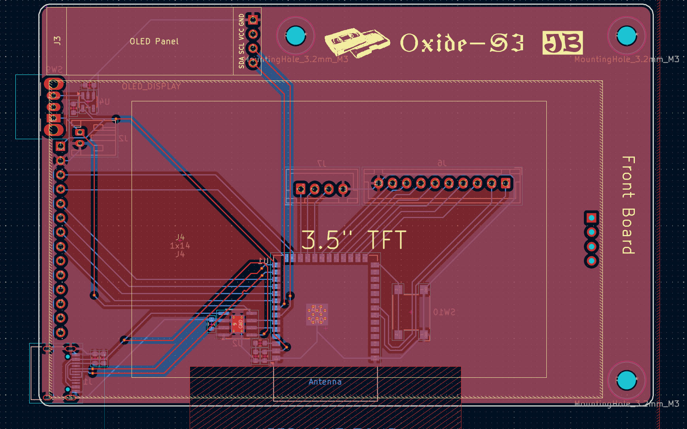

Top PCB:

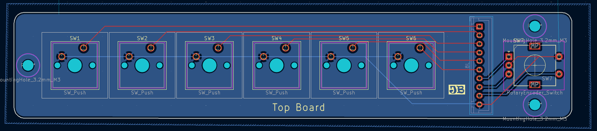

Side PCB:

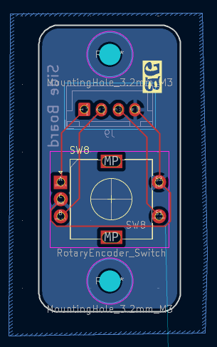

Schematic:

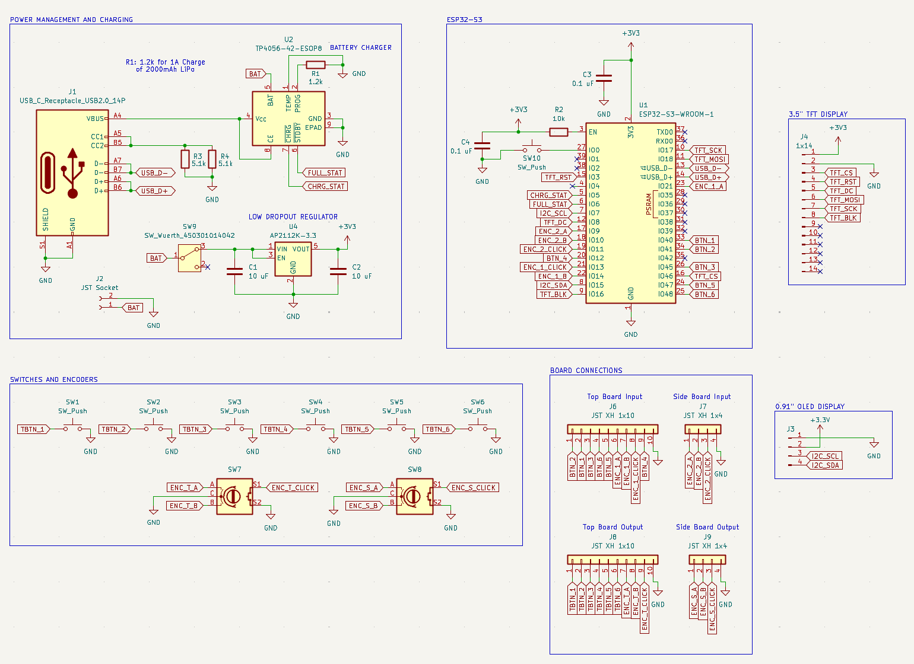

# Assembly

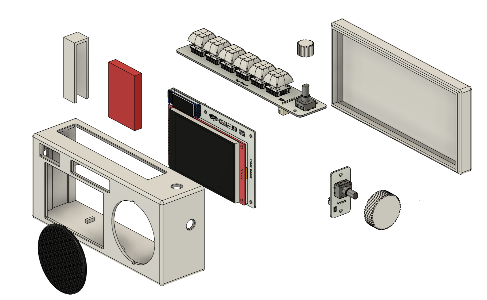

The assembly is performed in several steps. First, 8 M3x5x5 threaded inserts are installed to the standoffs in the 3D printed front case. Then, the three PCBs are secured using M3x6 bolts.

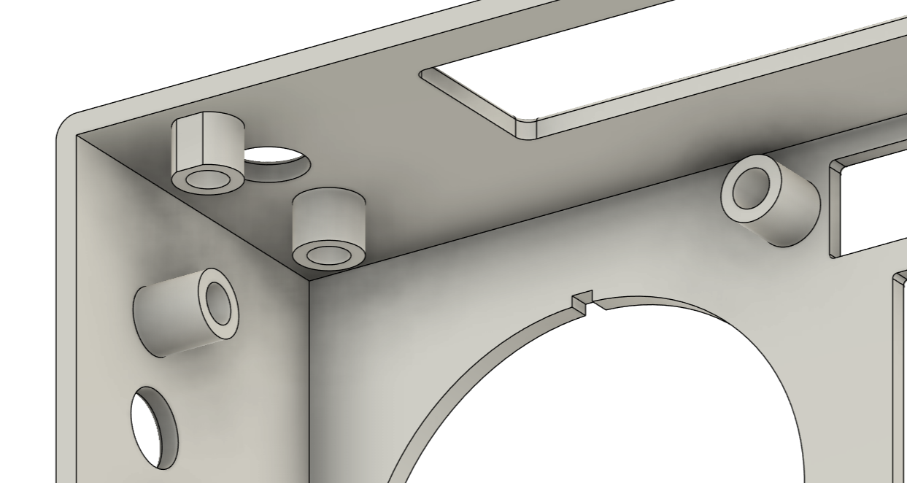

 After the PCBs are installed, the battery holder module is press-fit into the front case, and the LiPo battery (red) is slid into place.

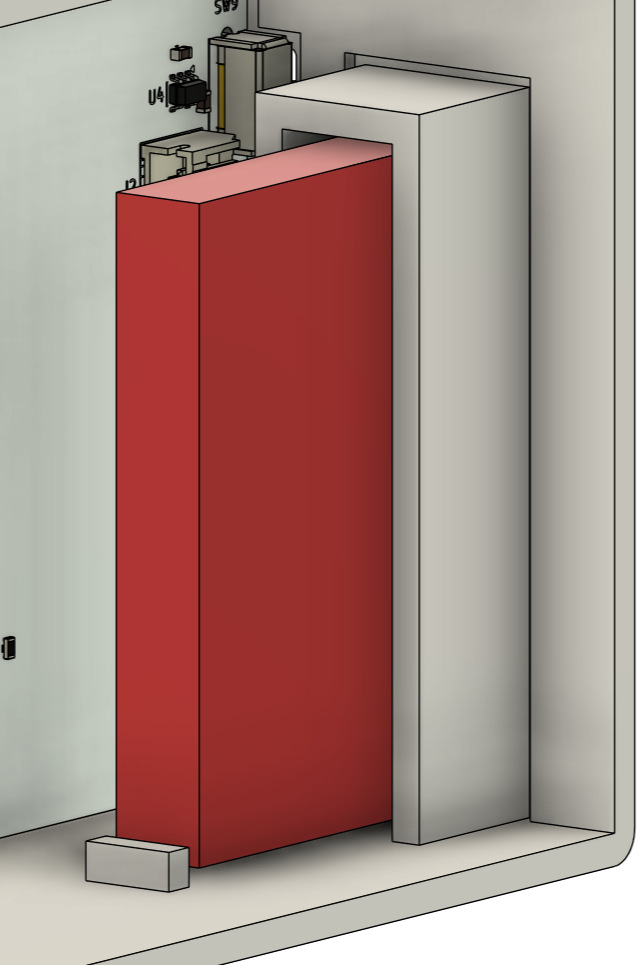

Then, the speaker and back case are press-fit into place. There is a 0.2mm tolerance built into the CAD model. 

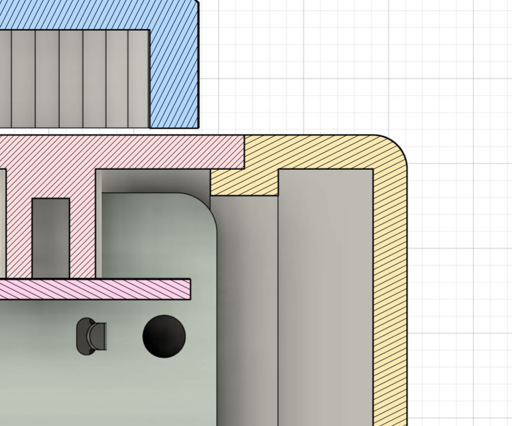

Finally, the side and top knob are  press-fit onto the rotary encoders. This concludes the assembly.

# Software

Taking inspiration from [Donatnan Jong](https://github.com/Dongathan-Jong), I plan to utilize Spotify's built-in [developer interface](https://developer.spotify.com/) and Adafruit display libraries to program the screens in the Arduino IDE. Since Wifi is easily handled by the ESP32 and the switches handled by Spotify's interface, the main focus would be on managing the displays. Given my short project turnaround time, I will update this repo once parts arrive.

The TFT screen will be controlled through SPI, and the OLED through I2C. To add images, I'll use a bitmap tool to add features. Below are the major functions of the two displays:

|3.5" TFT|
| :---: |
|Spotify symbol|
|Song timestamp|
|Audio wave animation|
|Key switch/encoder map|
|Album navigation|
|Spotify username|

|0.91" OLED|
| :---: |
|Battery charge status|
|Clock|
|Volume/Mute symbol|
|Wifi status|

Like I mentioned, this project is super last minute (started like 20 hours ago to get in submission). I'll write the code and update this repo once I recieve the parts, and show off what the Oxide-S3 can do.Here's an example of how simple the code can be, written by [Donatnan Jong](https://github.com/Dongathan-Jong):

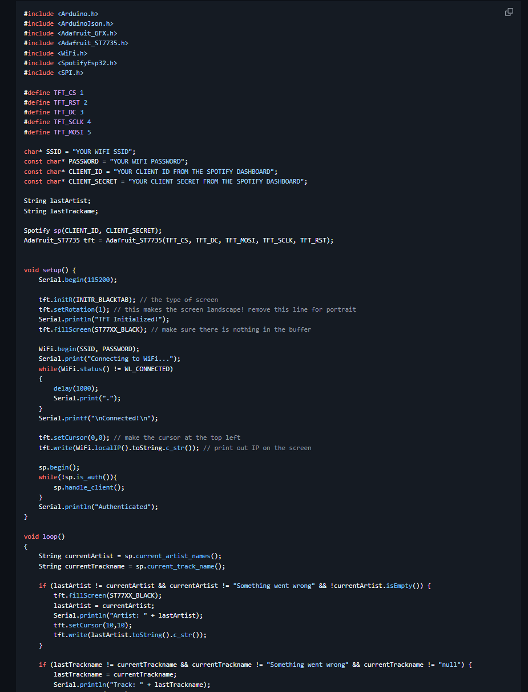

# BOM

| Part | Quantity | Price Per | Link | 
| :--- | :---: | :---: | :--- |
| **0.91" OLED** | 1 | $1.95 | [AliExpress](https://www.aliexpress.us/item/3256806449757543.html) |
| **3.5" TFT** | 1 | $10.45 | [AliExpress](https://www.aliexpress.us/item/3256801812264108.html) |  
| **ESP32-S3-WROOM-1-N8R8** | 1 | $6.13 | [DigiKey](https://www.digikey.com/short/wq4p3rwv) |
| **LDO** | 1 | $0.22 | [DigiKey](https://www.digikey.com/short/b2m9hq2c) |
| **Battery Charger** | 1 | $0.47 | [DigiKey](https://www.digikey.com/short/dz9hbfw5) |
| **USB-C Recepticle** | 1 | $0.78 | [DigiKey](https://www.digikey.com/short/rnhfh9zp) |
| **Rotary Encoder** | 2 | $1.72 | [DigiKey](https://www.digikey.com/short/1mq4zdpt) |
| **Boot Button** | 1 | $0.56 |[DigiKey](https://www.digikey.com/short/q5bt28qt) |
| **Slide Switch** | 1 | $0.65 | [DigiKey](https://www.digikey.com/short/41mc094h) |
| **1x2 JST-PH** | 1 | $0.11 | [DigiKey](https://www.digikey.com/short/41b2w40z) |
| **1x10 JST-XH** | 2 | $0.32 |[DigiKey](https://www.digikey.com/short/5571c5z5) |
| **1x4 JST-XH** | 2 | $0.14 | [DigiKey](https://www.digikey.com/short/h5trn14w) |
| **1.2k R 0603** | 1 | $0.10 |[DigiKey](https://www.digikey.com/short/hnr0jfrp) |
| **5.1k R 0603** | 2 | $0.10 |[DigiKey](https://www.digikey.com/short/mmd3843z) |
| **10k R 0603** | 1 | $0.10 | [DigiKey](https://www.digikey.com/short/p59dnbn3) |
| **0.1uF C 0603** | 2 | $0.12 |[DigiKey](https://www.digikey.com.au/short/w83wjqbv) |
| **10uF C 0603** | 2 | $0.35 |[DigiKey](https://www.digikey.com/short/5dtppp4z) |
| **DSA Keycaps 10pcs** | 1 | $5.95 |[DigiKey](https://www.digikey.com/short/p4j0ztf5) |
| **Cherry MX Blue 10pcs** | 1 | $4.00 |[MechanicalKeyboards](https://mechanicalkeyboards.com/products/cherry-mx-blue-60g-clicky) |
| **1x10 JST-XH Jumper** | 1 | $3.40 |[AliExpress](https://www.aliexpress.us/item/3256807069159656.html) |
| **1x4 JST-XH Jumper** | 1 | $2.36 |[AliExpress](https://www.aliexpress.us/item/3256807069159656.html) |
| **1S 1500mAh LiPo** | 1 | (have) |[SparkFun](https://www.sparkfun.com/lithium-ion-battery-1500mah-iec62133-certified.html#content-documentation) |
| **MicroSD** | 1 | (have) | |
| **M3x6 Bolt** | 8 | (have) | |
| **M3x5x5 Threaded Insert** | 8 | (have) | |

Totals
---
| Service  | Price | 
| :--- | :--- |
| **JLCPCB Order** | $48.49 | |
| **DigiKey Order** | $32.36 | 
| **AliExpress Order** |  $19.44 | 
| **MechanicalKeyboards Order** |  $9.52 | 

This total comes out to $109.81 which is slightly over my limit. I'll downgrade to some generic Cherry MX Red switches I already have, which  brings the total to  **$100.29**.

Orders:

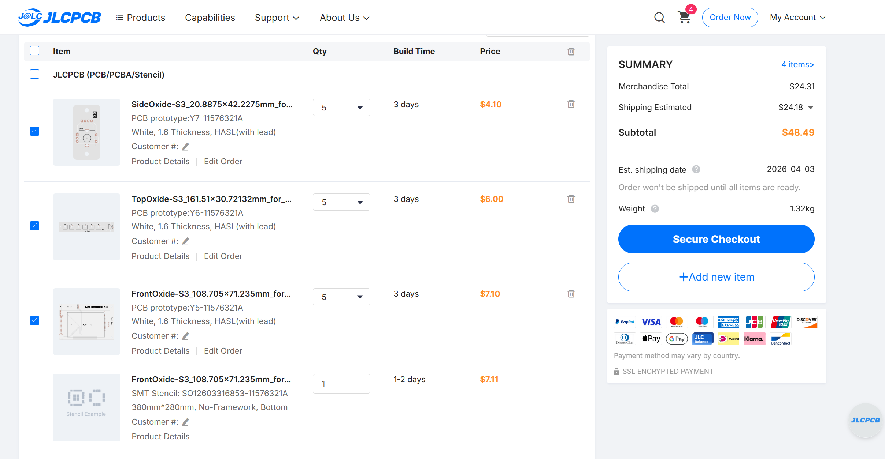
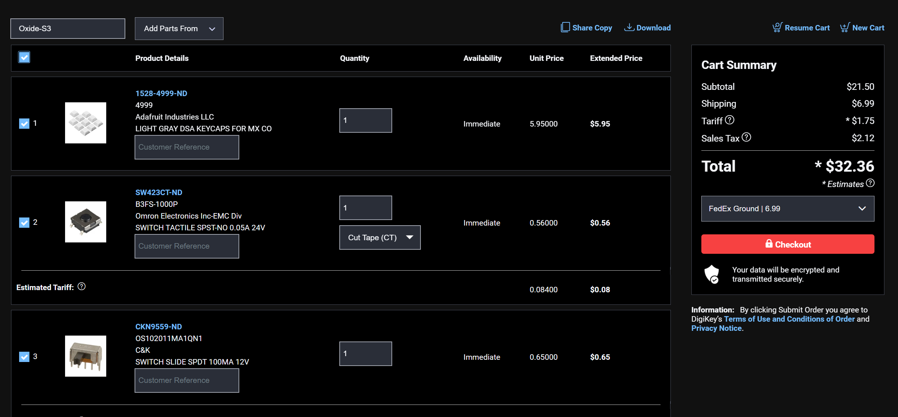
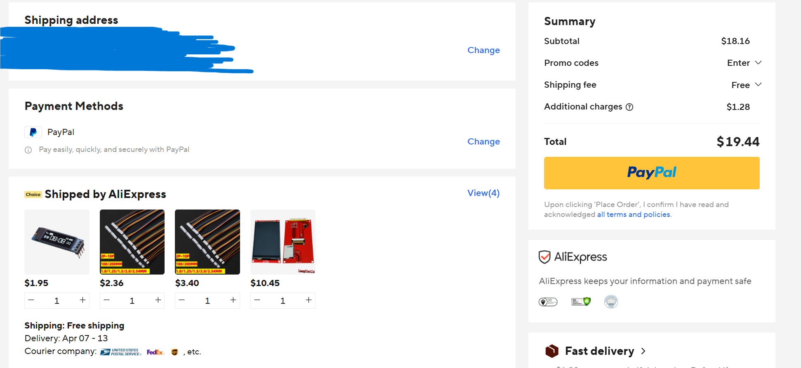
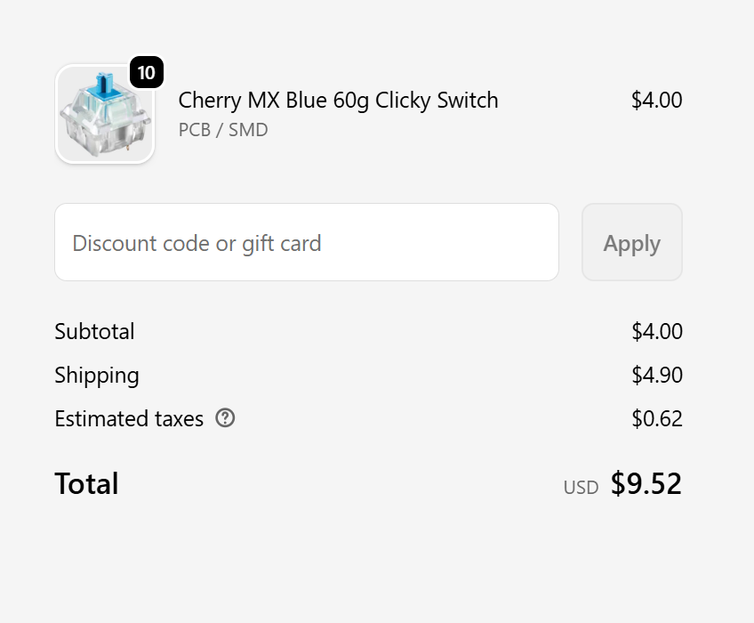

